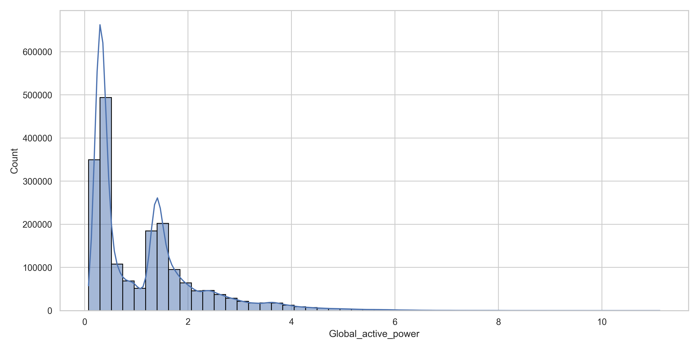
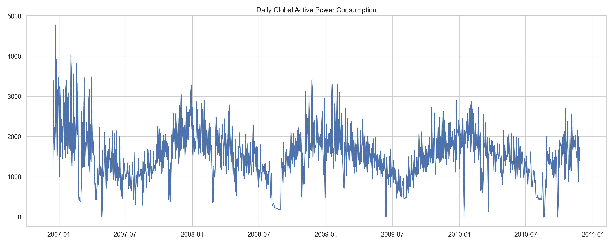
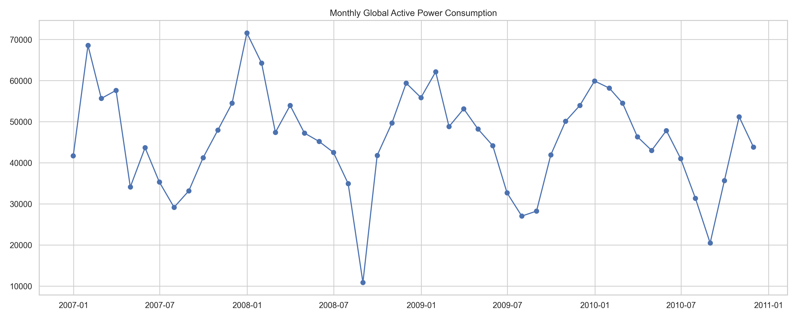
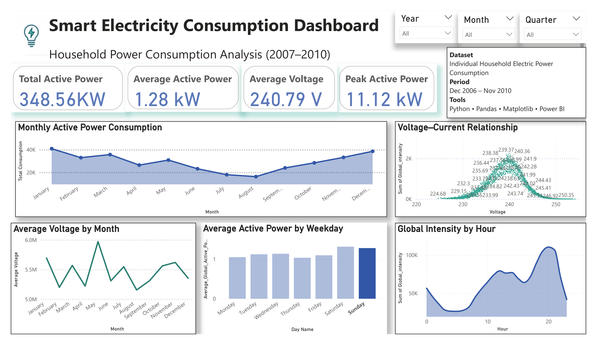

# ⚡ Smart Electricity Consumption Analysis


---

# 📌 Project Overview

This project analyzes household electricity consumption using **Python** and **Power BI**.

The objective is to clean raw electricity consumption data, perform Exploratory Data Analysis (EDA), create meaningful visualizations, and build an interactive Power BI dashboard to identify electricity consumption patterns and trends.

This project demonstrates an end-to-end Data Analytics workflow from raw data to business insights.

---

# 🎯 Objectives

- Clean and preprocess raw data
- Perform Exploratory Data Analysis (EDA)
- Visualize electricity consumption patterns
- Build an interactive Power BI dashboard
- Extract meaningful business insights

---

# 📂 Dataset Information

**Dataset Name**

Individual Household Electric Power Consumption

**Time Period**

December 2006 – November 2010

**Dataset Size**

- Approximately 2 Million Records
- Multiple Electrical Parameters

**Main Features**

- Global Active Power
- Global Reactive Power
- Voltage
- Global Intensity
- Sub Metering 1
- Sub Metering 2
- Sub Metering 3
- Date
- Time

---

# 🛠️ Tools & Technologies

- Python
- Pandas
- NumPy
- Matplotlib
- Power BI
- Git
- GitHub

---

# 🔄 Project Workflow

```text
Raw Dataset
      │
      ▼
Data Cleaning
      │
      ▼
Exploratory Data Analysis
      │
      ▼
Python Visualizations
      │
      ▼
Power BI Dashboard
      │
      ▼
Business Insights
```

---

# 📊 Python Visualizations

## Distribution of Global Active Power



Shows the overall distribution of household electricity consumption.

---

## Daily Global Active Power Consumption



Illustrates day-to-day electricity consumption trends.

---

## Monthly Global Active Power Consumption



Shows long-term monthly consumption patterns.

---

## (Add Your Remaining Charts Here)

Example:

```text
Voltage Distribution

Hourly Consumption

Weekday Consumption

Scatter Plot
```

Add each saved chart from the `images` folder.

---

# 📈 Power BI Dashboard

## Interactive Dashboard



The dashboard contains:

- KPI Cards
- Monthly Consumption Trend
- Average Voltage by Month
- Average Consumption by Hour
- Average Consumption by Weekday
- Voltage vs Current Relationship
- Interactive Filters

---

# 🔍 Key Insights

- Household electricity consumption varies significantly throughout the year.
- Peak Active Power reached approximately **8.69 kW**.
- Average household voltage remained close to **238 V**.
- Electricity usage changes noticeably during different hours of the day.
- Weekday consumption patterns remain relatively stable.
- Voltage and current exhibit a positive relationship under normal operating conditions.

---

# 📁 Project Structure

```text
Smart-Electricity-Consumption-Analysis/

│
├── data/
│
├── images/
│   ├── powerbi_dashboard.png
│   ├── global_active_power_distribution.png
│   ├── daily_global_active_power.png
│   ├── monthly_global_active_power.png
│   └── ...
│
├── src/
│   ├── data_loader.py
│   ├── data_cleaning.py
│   ├── eda.py
│   ├── visualization.py
│   └── main.py
│
├── requirements.txt
├── LICENSE
└── README.md
```

---

# ▶️ How to Run

1. Clone the repository

```bash
git clone https://github.com/AnuragMishra203/Smart-Electricity-Consumption-Analysis.git
```

2. Install dependencies

```bash
pip install -r requirements.txt
```

3. Run the project

```bash
python src/main.py
```

4. Open the Power BI dashboard (.pbix) using Microsoft Power BI Desktop.

---

# 🚀 Future Improvements

- Electricity Consumption Forecasting using Machine Learning
- Anomaly Detection
- Streamlit Web Dashboard
- Automatic Dashboard Refresh
- Additional Time-Series Analysis

---

# 👨‍💻 Author

**Anurag Mishra**

Mechanical Engineering Student | Aspiring Data Analyst

If you found this project helpful, feel free to ⭐ the repository.

---

## ⭐ If you like this project, don't forget to give it a star!
